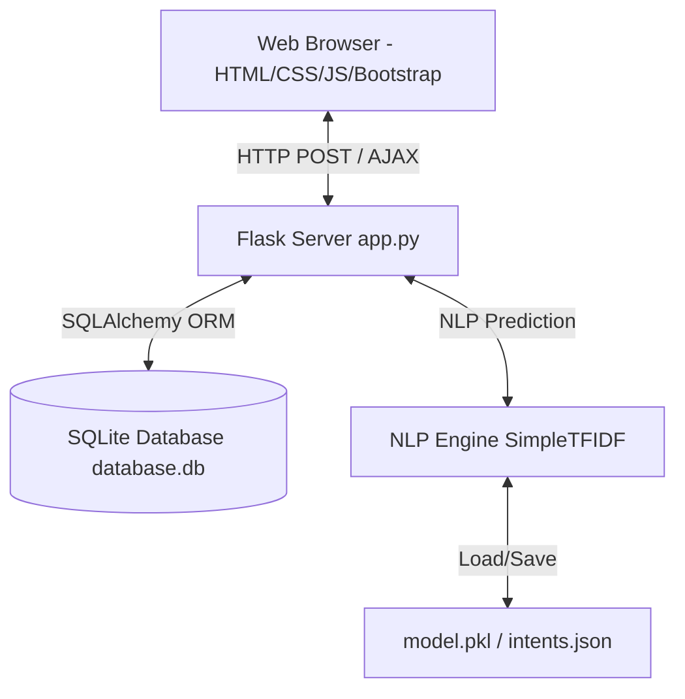

# AI-Based Customer Support Chatbot System

A complete full-stack web application implementing an intent-based AI chatbot, customer dashboard, ticketing console, and a comprehensive administration dashboard with analytics.

---

## 1. Project Abstract
The **AI-Based Customer Support Chatbot System** is designed to streamline customer service operations. By deploying an intent-based Natural Language Processing (NLP) model on customer inquiries, the system provides real-time, automated answers to common questions (orders, billing, refunds, products). When queries exceed the AI's understanding, it integrates a seamless escalation channel to human representatives by auto-generating tracked support tickets.

## 2. Problem Statement
Traditional customer support operations are resource-intensive, suffer from delayed response cycles, and lack structured automation for repetitive tasks. 
- **High Operational Cost**: Dedicated support staffs spend hours answering identical FAQs.
- **Latency**: Customers experience delays waiting for replies to trivial questions (e.g. order tracking or return policy).
- **Fragmented History**: Conversations are rarely linked to formal ticket logs, causing service quality decay.

## 3. Existing System vs. Proposed System
### Existing System (Manual / Linear)
- Requires manual intervention for every inquiry.
- High average handle time (AHT).
- Customer history is isolated, making context transfer difficult.
- Tickets are created from scratch manually by users or representatives.

### Proposed System (Automated + Escalation Model)
- **First-line AI Defense**: Handles common user issues immediately (under 2 seconds).
- **Graceful Escalation**: Automatically binds complex or unknown intent queries into support tickets.
- **Integrated Admin View**: Tracks live conversation logs, FAQ content, and users.
- **Interactive Analytics**: Displays trends using Chart.js to help managers monitor volume.

## 4. Objectives & Scope
- **Objectives**: Reduce support wait times, automate FAQ resolutions, offer a unified ticketing workflow, and empower admins with query statistics.
- **Scope**: Implemented as a full-stack Flask application suitable for deployment on cloud services like Render, utilizing SQLite/SQLAlchemy for relational database persistence.

## 5. System Requirements
### Functional Requirements
- Secure session-based User Authentication.
- Dynamic conversational interface with typing animations.
- REST API endpoint for chat predictions.
- Automated creation of support tickets upon chat escalation.
- Admin dashboard metrics and data graphs.
- Full CRUD controls on FAQs, support tickets, and user accounts.

### Non-Functional Requirements
- **Performance**: Chat prediction responses under 100ms.
- **Security**: SHA-256 hashed passwords via Werkzeug; CSRF secure sessions.
- **Scalability**: Decoupled models using SQLAlchemy ORM for SQLite/PostgreSQL compatibility.
- **Usability**: Fully responsive styling via Bootstrap 5 across mobile and desktop.

---

## 6. System Architecture & Modules



### Module Descriptions
1. **User Authentication**: Validates credentials and maps session contexts using `Flask-Login`.
2. **AI Engine (`chatbot_engine.py`)**: Uses custom TF-IDF tokenization and Cosine Similarity mapping to compute matching confidence scores.
3. **Customer Hub**: Lets users create conversations, review support histories, and file issues.
4. **Admin Dashboard**: Aggregates statistics for daily chats, intents, and ticket ratios. Provides FAQ editing, ticket replies, and account role changes.

---

## 7. Use Case Diagram Description
- **Customer Actors**: Can register accounts, start chats, query the bot, trigger manual/automatic escalations, submit support tickets, and track ticket status.
- **Admin Actors**: Can review all conversations, reply to customer tickets, update ticket status, insert/edit/delete FAQs, change user permissions (roles), and analyze Chart.js usage graphs.

---

## 8. Database Schema

The database consists of 6 tables linked via foreign keys:

### `users`
- `id` (Integer, Primary Key)
- `username` (String, Unique, Not Null)
- `email` (String, Unique, Not Null)
- `password_hash` (String, Not Null)
- `role` (String, default='customer')
- `created_at` (DateTime)

### `conversations`
- `id` (Integer, Primary Key)
- `user_id` (Integer, Foreign Key to `users.id`)
- `title` (String)
- `status` (String, default='active')
- `created_at` (DateTime)

### `messages`
- `id` (Integer, Primary Key)
- `conversation_id` (Integer, Foreign Key to `conversations.id`)
- `sender` (String, User/Bot/Agent)
- `message_text` (Text)
- `intent` (String, Nullable)
- `confidence` (Float, Nullable)
- `created_at` (DateTime)

### `faqs`
- `id` (Integer, Primary Key)
- `question` (String)
- `answer` (Text)
- `category` (String)
- `created_at` (DateTime)

### `support_tickets`
- `id` (Integer, Primary Key)
- `user_id` (Integer, Foreign Key to `users.id`)
- `subject` (String)
- `description` (Text)
- `status` (String, default='pending')
- `priority` (String, default='medium')
- `category` (String)
- `admin_reply` (Text, Nullable)
- `created_at` (DateTime)
- `updated_at` (DateTime)

### `chatbot_intents`
- `id` (Integer, Primary Key)
- `intent_name` (String, Unique)
- `patterns` (Text, JSON list)
- `responses` (Text, JSON list)

---

## 9. Local Execution Guide

To run the application locally on your machine, follow these steps:

### Step 1: Install Dependencies
Open your command terminal inside the project directory and install the requirements:
```bash
pip install -r requirements.txt
```

### Step 2: Initialize & Train the Chatbot
Run the training script to generate the serialized classifier file (`model.pkl`):
```bash
python chatbot/train_model.py
```

### Step 3: Run the Flask Server
Launch the development server:
```bash
python app.py
```

### Step 4: Access in Web Browser
Open your browser and navigate to:
```
http://127.0.0.1:5000/
```

### Pre-Seeded Testing Accounts
During startup, the database is pre-seeded with two accounts for ease of testing:
1. **Customer Account**:
   - Email: `customer@support.com`
   - Password: `customer123`
2. **Admin Account**:
   - Email: `admin@support.com`
   - Password: `admin123`

---

## 10. Render Deployment Instructions

This project is gunicorn and environment-ready. To deploy on [Render](https://render.com):

1. **Push Code to GitHub**: Create a repository on GitHub and commit all code files.
2. **Create Web Service on Render**:
   - Link your GitHub account to Render.
   - Choose your repository.
3. **Configure Settings**:
   - **Environment**: `Python`
   - **Build Command**: `pip install -r requirements.txt` (or if you wish, append training: `pip install -r requirements.txt && python chatbot/train_model.py`)
   - **Start Command**: `gunicorn app:app`
4. **Add Environment Variables** (Optional, under "Env Vars" tab):
   - Key: `SECRET_KEY` | Value: *[custom secure string]*
   - Key: `DATABASE_URL` | Value: *[optional external Postgres URL, default is local SQLite]*
5. **Deploy**: Render will automatically build the container and spin up Gunicorn on the allocated host!

---

## 11. Conclusion & Future Enhancements
The AI Customer Support Bot successfully integrates automation with human backup. Future iterations could leverage large language models (LLMs) via OpenAI/Gemini API calls for broader semantic matches, incorporate live web-sockets (Socket.io) for real-time human agent chats, and integrate email notifications for support updates.
